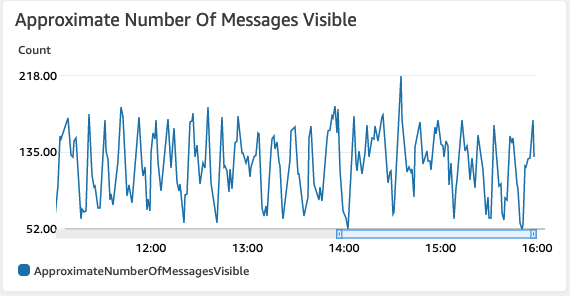

# Event Driven Autoscaling on Kubernetes with KEDA Scalars

The developer at Mystique Unicorn are interested in building their application using event-driven architectural pattern to process streaming data. For those who are unfamiliar, _An event-driven architecture uses events to trigger and communicate between decoupled services and is common in modern applications built with microservices. An event is a change in state, or an update, like an item being placed in a shopping cart on an e-commerce website._

In this application, they will have their physical stores, send a stream _sales_ and _inventory_ related events to a central location(a message queue), where multiple downstream systems are consuming these events. The _consumers_ are running on kubernetes pods.


Native kubernetes Horizontal Pod Autoscaler (HPA) scales resources based on a provided metric (usually CPU or Memory utilization), however it does not have native support for event-sources(_yet_). As such, there is a delay in scale-up of new Pods while the event source gets populated with events. In this case the queue length increases to undesirable levels before new consumer pods are added to the deployment. AWS SQS exposes a metric `ApproximateNumberOfMessagesVisible` - Which is the number of messages available for retrieval from the queue. They are interested in using metrics like this to scale the _consumers_.

Can you help them to solve this problem?

## 🎯 Solutions

Kubernetes has native support metrics APIs<sup>[1]</sup>. We need a mechanism to scale our deployments using custom metrics from say Cloudwatch or message queue length to be fed into this API. There are quite a few ways of doing this, One method is to use AWS Cloudwatch Metrics Adapter <sup>[2],[3]</sup>. _Unfortunately, This adapter does not seem to be actively developed anymore. That last commits were 2 years back._

**Introducing KEDA: Kubernetes-based Event-Driven Auto-Scaler**<sup>[4]</sup> - KEDA is a single-purpose, lightweight, open-source component that allows you to easily scale Kubernetes applications based on metrics coming from a variety of cloud providers and other technologies that are not supported out-of-the-box. KEDA works alongside standard Kubernetes components like the HPA and can extend its functionalities by allowing it to scale according to the number of events in the event source.In this demo, We will learn how we can use KEDA to auto-scale our _consumer_ pods based on message queue depth.

We will build a EKS cluster with a managed node groups running `2` _t2.medium_ nodes. We will also have a _producer_ deployment writing messages to a SQS queue. A _consumer_ running as deployment will process those messages and store them on S3. Here are the attributes of cluster that are baked into the CDK stacks.

- **EKS Cluster** - Our primary cluster with `2` managed node groups.
- **SQS Queue** - A standard SQS queue with a visibility timeout of `30` seconds, This allows our consumer `30` seconds to successfully process message and delete them from the queue.
- **Sales Events Bucket** - Persistent storage for the consumer to store the events.
- **Producer** - A deployment running an generic container `python:3.8.10-alpine`. The producer code is pulled from this github directly. It will produce `1` message every `2` seconds and runs to produce a maximum of `10000` messages. Being a _deployment_, it will be restarted and goes on to produce the next batch of _10000_ messages.
- **Consumer** - A deployment running generic container `python:3.8.10-alpine`. The consumer code is pulled from this github directly. Every `10` seconds it will process messages in batches of `5`. The incoming messages will be stored persistently in _Sales Events Bucket_. It will process a maximum of `10000` messages.

  **Note**:

  1. Both the _producer_ and _consumer_ use AWS IAM Roles for Service Accounts(IRSA)<sup>[5]</sup> to interact with AWS resources. If you are unfamiliar with IRSA, pods require privileges to access AWS resources like SQS, S3, RDS etc. We can create a IAM role with limited permission and enable kubernetes service account used by the application to assume that role. This enables us to provision fine-grained permissions for each of our application groups. In this case, the _producer_ has only access to one SQS queue; Whereas the _consumer_ has access to SQS and to S3

  1. As there are still some rough edges to get KEDA working with AWS IRSA<sup>[5]</sup>_(Check out this [github issue][6])_, we will have to use the helm cli to install Keda to apply the patch. I will show you what needs to be done during the stack deployments.

1. ## 🧰 Prerequisites

   This demo, instructions, scripts and cloudformation template is designed to be run in `us-east-1`. With few modifications you can try it out in other regions as well(_Not covered here_).

   - 🛠 AWS CLI Installed & Configured - [Get help here](https://youtu.be/TPyyfmQte0U)
   - 🛠 AWS CDK Installed & Configured - [Get help here](https://www.youtube.com/watch?v=MKwxpszw0Rc)
   - 🛠 Python Packages, _Change the below commands to suit your OS, the following is written for amzn linux 2_
     - Python3 - `yum install -y python3`
     - Python Pip - `yum install -y python-pip`
     - Virtualenv - `pip3 install virtualenv`

1. ## ⚙️ Setting up the environment

   - Get the application code

     ```bash
     git clone https://github.com/miztiik/scale-eks-with-keda
     cd scale-eks-with-keda
     ```

1. ## 🚀 Prepare the dev environment to run AWS CDK

   We will use `cdk` to make our deployments easier. Lets go ahead and install the necessary components.

   ```bash
   # You should have npm pre-installed
   # If you DONT have cdk installed
   npm install -g aws-cdk

   # Make sure you in root directory
   python3 -m venv .venv
   source .venv/bin/activate
   pip3 install -r requirements.txt
   ```

   The very first time you deploy an AWS CDK app into an environment _(account/region)_, you’ll need to install a `bootstrap stack`, Otherwise just go ahead and deploy using `cdk deploy`.

   ```bash
   cdk bootstrap
   cdk ls
   # Follow on screen prompts
   ```

   You should see an output of the available stacks,

   ```bash
   eks-cluster-vpc-stack
   eks-cluster-stack
   ssm-agent-installer-daemonset-stack
   sales-events-bkt-stack
   sales-events-producer-stack
   sales-events-consumer-stack
   eks-keda-stack
   ```

1. ## 🚀 Deploying the application

   Let us walk through each of the stacks,

   - **Stack: eks-cluster-vpc-stack**
     To host our EKS cluster we need a custom VPC. This stack will build a multi-az VPC with the following attributes,

     - **VPC**:
       - 2-AZ Subnets with Public, Private and Isolated Subnets.
       - 1 NAT GW for internet access from private subnets

     Initiate the deployment with the following command,

     ```bash
     cdk deploy eks-cluster-vpc-stack
     ```

     After successfully deploying the stack, Check the `Outputs` section of the stack.

   - **Stack: eks-cluster-stack**
     As we are starting out a new cluster, we will use most default. No logging is configured or any add-ons. The cluster will have the following attributes,

     - The control pane is launched with public access. _i.e_ the cluster can be access without a bastion host
     - `c_admin` IAM role added to _aws-auth_ configMap to administer the cluster from CLI.
     - One managed EC2 node group created from a launch template
       - It create two `t3.medium` instances running `Amazon Linux 2`
       - Auto-scaling Group with `2` desired instances.
       - The nodes will have a node role attached to them with `AmazonSSMManagedInstanceCore` permissions

     In this demo, let us launch the EKS cluster in a custom VPC using AWS CDK. Initiate the deployment with the following command,

     ```bash
     cdk deploy eks-cluster-stack
     ```

     After successfully deploying the stack, Check the `Outputs` section of the stack. You will find the `*ConfigCommand*` that allows yous to interact with your cluster using `kubectl`

   - **Stack: ssm-agent-installer-daemonset-stack**
     This EKS AMI used in this stack does not include the AWS SSM Agent out of the box. If we ever want to patch or run something remotely on our EKS nodes, this agent is really helpful to automate those tasks. We will deploy a daemonset that will _run exactly once?_ on each node using a cron entry injection that deletes itself after successful execution. If you are interested take a look at the deamonset manifest here `stacks/back_end/eks_cluster_stacks/eks_ssm_daemonset_stack/eks_ssm_daemonset_stack.py`. This is inspired by this AWS guidance<sup>[7]</sup>.

     Initiate the deployment with the following command,

     ```bash
     cdk deploy ssm-agent-installer-daemonset-stack
     ```

     After successfully deploying the stack, You can use connect to the worker nodes instance using SSM Session Manager<sup>[8]</sup>.

   - **Stack: sales-events-bkt-stack**

     This stack will create the s3 bucket. We will add a bucket policy to delegate all access management to be done by access points. _Although not required for this demo, we may use it in the future_.

     Initiate the deployment with the following command,

     ```bash
     cdk deploy sales-events-bkt-stack
     ```

     After successfully deploying the stack, Check the `Outputs` section of the stack. You will find the `SalesEventsBucket`.

   - **Stack: sales-events-producer-stack**

     We need an SQS queue for our producer to ingest message, So we will start by creating an SQS queue with the following attributes.

     - **Source Queue**: `reliable_q` - Producers will send their messages to this queue.
     - Any new message will be hidden(`DelaySeconds`) for `2` seconds
     - New message will be hidden<sup>[2]</sup>(`DelaySeconds`) for `2` seconds
     - To ensure messages are given enough time to be processed by the consumer, the visibility timeout is set to `30` seconds.
     - No Dead-Letter-Queue(DLQ) is set, _If you are interested in knowing more about DLQ, check out this demo[3]_.

     Now that we have the queue, lets discuss the producer.

     - **Namespace**: `sales-events-producer-ns` - We start by creating a new namespace. As this will be the usual case, where producers will be residing in their own namespace.
     - **Deployment**: `sales-events-producer` - This stack will create a kubernetes deployment within that namespace with `1` replica running the vanilla container `python:3.8.10-alpine`. The producer code is pulled using `wget <URL>` from the container `CMD`. If you are interested take a look at the producer code here `stacks/back_end/eks_sqs_producer_stack/lambda_src/stream_data_producer.py`. At this moment you have two customization possible. They are all populated with defaults, They can be modified using pod environment variables

       - `TOT_MSGS_TO_PRODUCE`- Use this to define the maximum number of messages you want to produce per pod lifecycle. If you want to produce a maximum of `1000`. As the pod exits successfully upon generating the maximum messages. Kubernetes will restart the pod automatically and triggering the next batch of `1000` messages. \_Defaults to `10000`.
       - `WAIT_SECS_BETWEEN_MSGS` - Use this to vary the message ingestion rate. If you want higher number of messages, reduce this to lower values. Setting it to `0` will have a very high rate of ingest. _Defaults to `2` (waits for 2 seconds between burst of message ingestion)_

     Finally, although not mentioned explicitly, It is quite possible to increase the replicas to generate more messages to the queue. <sup><sub>TODO:Another interesting feature to add to the producer: Deliberately generate duplicate messages.</sub><sup>

     Initiate the deployment with the following command,

     ```bash
     cdk deploy sales-events-producer-stack
     ```

     After successfully deploying the stack, Check the `Outputs` section of the stack. You will find the `ReliableMessageQueue` and `ReliableMessageQueueUrl` resource. You should be able to run `kubectl` command to list the deployment `kubectl get deployments -n sales-events-producer-ns`.

   - **Stack: sales-events-consumer-stack**

     Just like our producer, the consumer will also be running as a deployment. We can make a case for running a kubernetes Job<sup>[4]</sup> or even a CronJob<sup>[5]</sup>. _I would like to reserve that for a future demo, as the cronjob is only stable in kubernetes `v1.21`_. Let us take a closer look at our deployment.

     - **Namespace**: `sales-events-consumer-ns` - We start by creating a new namespace. As this will be the usual case, where consumers will be residing in their own namespace.
     - **Deployment**: `sales-events-consumer` - This stack will create a kubernetes deployment within that namespace with `1` replica running the vanilla container `python:3.8.10-alpine`. The consumer code is pulled using `wget <URL>` from the container `CMD`. If you are interested take a look at the consumer code here `stacks/back_end/eks_sqs_consumer_stack/lambda_src/stream_data_consumer.py`. At this moment you have few customization possibles. They are all populated with defaults, They can be modified using pod environment variables.

       - `MAX_MSGS_PER_BATCH`- Use this to define the maximum number of messages you want to get from the queue for each processing cycle. For example, Set this value to `10`, if you want to process a batch of `10` messages . _Defaults to 5_.
       - `TOT_MSGS_TO_PROCESS` - The maximum number of messages you want to process per pod. The pod exits successfully upon processing the maximum messages. Kubernetes will restart the pod automatically and initiating the next batch of messages to process. _Defaults to `10000`_.
       - `MSG_POLL_BACKOFF` - Use this to define, how often you want the consumer to poll the SQS queue. This is really important to avoid being throttled by AWS when there are **no messages**. This parameter only comes into effect only when there are no messages in the queue. I have implemented a _crude_ back-off that will double the wait time for each polling cycle. It starts by polling after `2`, `4`, `8`...`512`secs. It goes up to a maximum of `512` and resets to `2` after that. _Defaults to `2`_.
       - `MSG_PROCESS_DELAY` - Use this to define the wait time between messaging processing to simulate realistic behaviour. Set this to `30` if you want to wait `30` seconds between every processing cycle. _Defaults to `10`_

     Initiate the deployment with the following command,

     ```bash
     cdk deploy sales-events-consumer-stack
     ```

     After successfully deploying the stack, Check the `Outputs` section of the stack. You should be able to run `kubectl` command to list the deployment `kubectl get deployments -n sales-events-consumer-ns`.

   - **Stack: eks-keda-stack**

     There are many ways to deploy KEDA to our EKS cluster - Helm<sup>[9]</sup>, YAML file etc. We want our KEDA to be able to interact with AWS to get the SQS metrics<sup>[10]</sup> like `ApproximateNumberOfMessagesVisible`. To do this, we need to bootstrap the `keda-operator` service account with an IAM Role annotation<sup>[5]</sup>.

     To do that, we will use this stack to create the following resources,

     - **Namespace**: `keda` - A dedicated namespace for all KEDA resources.

     - **AWS IAM Role**:

       - Permissions for CloudWatch and SQS, (As of now it is extremely permissive, we should scope it down further; _topic for another blog incoming_)
       - The KEDA service account should be able to assume this IAM Role. We will add the OIDC provider trust relationship to do that. A sample of the trust relationship is shown below,

       ```json
       {
         "Version": "2012-10-17",
         "Statement": [
           {
             "Effect": "Allow",
             "Principal": {
               "Federated": "arn:aws:iam::111122223333:oidc-provider/oidc.eks.us-east-1.amazonaws.com/id/9FBA1ECBCD00CB8AEF0D8"
             },
             "Action": "sts:AssumeRoleWithWebIdentity",
             "Condition": {
               "StringEquals": {
                 "oidc.eks.us-east-1.amazonaws.com/id/9FBA1ECBCD00CB8AEF0D8:sub": "system:serviceaccount:keda:keda-operator"
               }
             }
           }
         ]
       }
       ```

     - **Service Account**: `keda-operator`. This service account will be annotated with the IAM Role arn created in the previous step. An example annotation looks like this,

       `eks.amazonaws.com/role-arn = arn:aws:iam::111122223333:role/eks-keda-stack-kedasvcaccntrole`

     **Note**: _KEDA is evolving very fast and there is possibility that some of the APIs and kubernetes object names might change when it graduates, refer to the docs if you run into issues._

     Initiate the deployment with the following command,

     ```bash
     cdk deploy eks-keda-stack
     ```

     After successfully deploying the stack, Check the `Outputs` section of the stack.

   - **Install KEDA on EKS**

     We are all set to install KEDA on our EKS cluster. To allow KEDA to take advantage of the previously created `keda` namespace and `keda-operator` service account, we will use the helm cli to install KEDA. If you do not have helm in your local environment, use these instructions<sup>[11]</sup> to get it. As of writing this demo, KEDA `2.3.0` is the latest version, update the `KEDA_VERSION` variable if needed.

     ```sh
     # Ref: https://keda.sh/docs/2.3/deploy/
     KEDA_VERSION=2.3.0

     helm install keda kedacore/keda \
         --version ${KEDA_VERSION} \
         --set serviceAccount.create=false \
         --set serviceAccount.name=keda-operator \
         --set  podSecurityContext.fsGroup=1001 \
         --set podSecurityContext.runAsGroup=1001 \
         --set podSecurityContext.runAsUser=1001  \
         --namespace keda
     ```

     The additional instructions for the security context allows KEDA to use the IRSA mounted secrets, as this is a patch for a known [github issue][6] around mounting secrets and permissions to access them.

     After successful deployment, confirm your KEDA operator is able to see the AWS secrets

     ```sh
     helm list -A
     kubectl get pods -n keda
     kubectl describe pods keda-operator-7d697b9c5b-nvbmj -n keda | grep -i aws   # ensure IRSA annotation working.
     ```

     _Expected Outputs:_

     ```sh
      ]# kubectl get pods -n keda
      NAME                                             READY   STATUS    RESTARTS   AGE
      keda-operator-6c859bf568-ztgv2                   1/1     Running   0          21h
      keda-operator-metrics-apiserver-d4d44789-tqctz   1/1     Running   0          21h
      ]# kubectl describe pods keda-operator-6c859bf568-ztgv2 -n keda | grep -i aws
            AWS_DEFAULT_REGION:           us-east-1
            AWS_REGION:                   us-east-1
            AWS_ROLE_ARN:                 arn:aws:iam::111122223333:role/eks-keda-stack-kedasvcaccntrole
            AWS_WEB_IDENTITY_TOKEN_FILE:  /var/run/secrets/eks.amazonaws.com/serviceaccount/token
            /var/run/secrets/eks.amazonaws.com/serviceaccount from aws-iam-token (ro)
        aws-iam-token:
     ```

   - **Deploy SQS Consumer Scalar**

     Now that we have all the necessary pieces to deploy our _consumer_ scaler. Here is my manifest for the scalar.The same yaml is also in the repo under the directory `stacks/back_end/keda_scalers/keda-sqs-consumer-scalar-with-irsa.yml` Let us walk through the specification.

     ```yaml
     ---
     apiVersion: keda.sh/v1alpha1 # https://keda.sh/docs/2.0/concepts/scaling-deployments/
     kind: ScaledObject
     metadata:
       name: sales-events-consumer-scaler
       namespace: sales-events-consumer-ns
       labels:
         app: sales-events-consumer
         deploymentName: sales-events-consumer
     spec:
       scaleTargetRef:
         kind: Deployment
         name: sales-events-consumer
       minReplicaCount: 1
       maxReplicaCount: 50
       pollingInterval: 30
       cooldownPeriod: 500
       triggers:
         - type: aws-sqs-queue
           metadata:
             queueURL: https://sqs.us-east-2.amazonaws.com/111122223333/reliable_message_q
             queueLength: "50"
             awsRegion: "us-east-2"
             identityOwner: operator
     ---
     ```

     KEDA SQS Scalar<sup>[12]</sup> is a kubernetes object of kind `ScaledObject`. We provide the target deployment to scale with _min_, _max_ values. We also need to specify the `queueURL`, `queueLength` and `awsRegion`. You should be able to find the `ReliableMessageQueueUrl` from the `sales-events-producer-stack` outputs.

     Once you have updated those values to match your environment, lets deploy this manifest,

     **Setup Kubeconfig**: You should be able to find the `kubeconfig` command in the output sections of this stack: `eks-cluster-stack`.

     ```sh
     # kubeconfig command is in the cfn output of eks-cluster-stack
     aws eks update-kubeconfig \
        --name c_1_event_processor \
        --region us-east-2 \
        --role-arn arn:aws:iam::11112223333:role/eks-cluster-stack-cAdminRole
     ```

     **Deploy KEDA Scalar**:

     ```sh
     $] kubectl apply -f stacks/back_end/keda_scalers/keda-sqs-consumer-scalar-with-irsa.yml
     scaledobject.keda.sh/sales-events-consumer-scaler created
     ```

     That is it!. We have setup our _consumer_ to scale automatically based on custom metrics. Let us check if everything is working as expected.

1. ## 🔬 Testing the solution

   As the producer and consumer deployments will be automatically started by the kubernetes cluster. We can check the scalar in action using the following commands. You can watch the scaler in action,

   1. **Check Consumer Scalar**:

      ```bash
      $]kubectl get hpa -w -n sales-events-consumer-ns
      NAME                                    REFERENCE                          TARGETS           MINPODS   MAXPODS   REPLICAS   AGE
      keda-hpa-sales-events-consumer-scaler   Deployment/sales-events-consumer   22500m/50 (avg)   1         50        4          5m18s
      keda-hpa-sales-events-consumer-scaler   Deployment/sales-events-consumer   22250m/50 (avg)   1         50        4          5m21s
      keda-hpa-sales-events-consumer-scaler   Deployment/sales-events-consumer   29667m/50 (avg)   1         50        3          5m37s
      ```

      Another way to check the events,

      ```bash
      kubectl get events -n sales-events-consumer-ns | grep horizontalpodautoscaler
      12m         Normal   SuccessfulRescale   horizontalpodautoscaler/keda-hpa-sales-events-consumer-scaler   New size: 4; reason: external metric AWS-SQS-Queue-reliable_message_q(&LabelSelector{MatchLabels:map[string]string{scaledObjectName: sales-events-consumer-scaler,},MatchExpressions:[]LabelSelectorRequirement{},}) above target
      15m         Normal   SuccessfulRescale   horizontalpodautoscaler/keda-hpa-sales-events-consumer-scaler   New size: 3; reason: All metrics below target
      5m12s       Normal   SuccessfulRescale   horizontalpodautoscaler/keda-hpa-sales-events-consumer-scaler   New size: 3; reason: All metrics below target
      4m10s       Normal   SuccessfulRescale   horizontalpodautoscaler/keda-hpa-sales-events-consumer-scaler   New size: 2; reason: All metrics below target
      3m55s       Normal   SuccessfulRescale   horizontalpodautoscaler/keda-hpa-sales-events-consumer-scaler   New size: 3; reason: external metric AWS-SQS-Queue-reliable_message_q(&LabelSelector{MatchLabels:map[string]string{scaledObjectName: sales-events-consumer-scaler,},MatchExpressions:[]LabelSelectorRequirement{},}) above target
      97s         Normal   SuccessfulRescale   horizontalpodautoscaler/keda-hpa-sales-events-consumer-scaler   New size: 4; reason: external metric AWS-SQS-Queue-reliable_message_q(&LabelSelector{MatchLabels:map[string]string{scaledObjectName: sales-events-consumer-scaler,},MatchExpressions:[]LabelSelectorRequirement{},}) above target
      ```

      You may face an error on the AWS GUI. For example, _You may not be able to see workloads or nodes in your AWS Management Console_. Make sure you using the same user/role you used to deploy the cluster. If they are different then you need to update the console user to kubernetes configmap.

   1. **Check Sales Events Consumer**:
      Our deployment of the consumer should already be running and consuming messages from our queue and writing them to our S3 bucket `SalesEventsBucket`.

      ```bash
      kubectl get deployments -n sales-events-consumer-ns
      ```

      _Expected Output_,

      ```bash
      $]kubectl get deployments -n sales-events-consumer-ns
      NAME                    READY   UP-TO-DATE   AVAILABLE   AGE
      sales-events-consumer   3/3     3
      ```

      ```bash
      kubectl get pods -n sales-events-consumer-ns
      ```

      _Expected Output_,

      ```bash
      NAME                                     READY   STATUS    RESTARTS   AGE
      sales-events-consumer-67c774c996-4smnw   1/1     Running   0          10m
      sales-events-consumer-67c774c996-94svr   1/1     Running   0          3h10m
      sales-events-consumer-67c774c996-9m4wb   1/1     Running   0          98m
      ```

   1. **Check SQS Queue**:

      You can also check the SQS console to verify the scaling in action. Check out the `Monitoring` tab of your queue. I have been running my cluster for quite some time with the scalar in action. Your view might be different than the one shown here, Here in the below screenshot, you can notice that the total number messages does not increase beyond a level as the scalar starts more _consumers_ to process those messages.

      

   1. **Check S3 Data Bucket for processed events**:

      Navigate to `SalesEventsBucket` in S3 Console, Here you can notice that the events are stored under two prefixes `sale_event` or `inventory_event`. As an example, here under the `inventory_event` prefix you will find the files received by our consumer function. You can use S3 select to view the files or download them and view them locally.

1. ## 📒 Conclusion

   Here we have demonstrated how to use KEDA to scale our kubernetes deployments using customer metrics events. As KEDA also exposes metrics to Prometheus, You can extend this solution to easily scrape the KEDA metrics to Prometheus and monitor them accordingly.

1. ## 🧹 CleanUp

   If you want to destroy all the resources created by the stack, Execute the below command to delete the stack, or _you can delete the stack from console as well_

   - Resources created during [Deploying The Application](#-deploying-the-application)
   - Delete CloudWatch Lambda LogGroups
   - _Any other custom resources, you have created for this demo_

   ```bash
   # Delete from cdk
   cdk destroy

   # Follow any on-screen prompts

   # Delete the CF Stack, If you used cloudformation to deploy the stack.
   aws cloudformation delete-stack \
     --stack-name "MiztiikAutomationStack" \
     --region "${AWS_REGION}"
   ```

   This is not an exhaustive list, please carry out other necessary steps as maybe applicable to your needs.

## 📌 Who is using this

This repository aims to show how to use KEDA to new developers, Solution Architects & Ops Engineers in AWS. Based on that knowledge these Udemy [course #1][102], [course #2][101] helps you build complete architecture in AWS.

### 💡 Help/Suggestions or 🐛 Bugs

Thank you for your interest in contributing to our project. Whether it is a bug report, new feature, correction, or additional documentation or solutions, we greatly value feedback and contributions from our community. [Start here](/issues)

### 👋 Buy me a coffee

[](https://ko-fi.com/Q5Q41QDGK) Buy me a [coffee ☕][900].

### 📚 References

1. [Kubernetes Docs: Support for metrics APIs][1]
1. [AWS Cloudwatch Metrics Adapter for Kubernetes][2]
1. [AWS Blog - Scaling K8s with Amazon CloudWatch metrics][3]
1. [Kubernetes-based Event-Driven Auto-Scaler (KEDA)][4]
1. [AWS Docs: IAM roles for service accounts][5]
1. [Github Issue: KEDA with AWS EKS IRSA][6]
1. [AWS Docs: Install SSM Agent on workers nodes using K8s DaemonSet][7]
1. [AWS SSM Session Manager][8]
1. [HELM Docs: Package manager for Kubernetes][9]
1. [AWS Docs: Amazon SQS metrics][10]
1. [HELM Docs: Install Helm][11]
1. [KEDA Docs: AWS SQS Queue Scalar][12]
1. [Blog: Kubernetes Network Policies][12]

### 🏷️ Metadata


**Level**: 300

[1]: https://kubernetes.io/docs/tasks/run-application/horizontal-pod-autoscale/#support-for-metrics-apis
[2]: https://github.com/awslabs/k8s-cloudwatch-adapter
[3]: https://aws.amazon.com/blogs/compute/scaling-kubernetes-deployments-with-amazon-cloudwatch-metrics/
[4]: https://keda.sh
[5]: https://aws.amazon.com/blogs/opensource/introducing-fine-grained-iam-roles-service-accounts/
[6]: https://github.com/kedacore/keda/issues/837#issuecomment-789037326
[7]: https://docs.aws.amazon.com/prescriptive-guidance/latest/patterns/install-ssm-agent-on-amazon-eks-worker-nodes-by-using-kubernetes-daemonset.html
[8]: https://www.youtube.com/watch?v=-ASMtZBrx-k
[9]: https://helm.sh/
[10]: https://docs.aws.amazon.com/AWSSimpleQueueService/latest/SQSDeveloperGuide/sqs-available-cloudwatch-metrics.html
[11]: https://helm.sh/docs/intro/install/
[12]: https://keda.sh/docs/2.3/scalers/aws-sqs/
[13]: https://faun.pub/control-traffic-flow-to-and-from-kubernetes-pods-with-network-policies-bc384c2d1f8c
[100]: https://www.udemy.com/course/aws-cloud-security/?referralCode=B7F1B6C78B45ADAF77A9
[101]: https://www.udemy.com/course/aws-cloud-security-proactive-way/?referralCode=71DC542AD4481309A441
[102]: https://www.udemy.com/course/aws-cloud-development-kit-from-beginner-to-professional/?referralCode=E15D7FB64E417C547579
[103]: https://www.udemy.com/course/aws-cloudformation-basics?referralCode=93AD3B1530BC871093D6
[899]: https://www.udemy.com/user/n-kumar/
[900]: https://ko-fi.com/miztiik
[901]: https://ko-fi.com/Q5Q41QDGK
